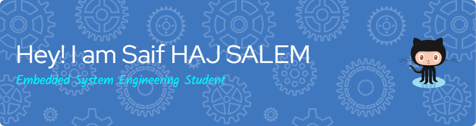

<h3 align="center">Robotics Software Engineer</h3>

 

 

  

- 🌱 I’m currently learning about humanoid robots, quadruped robots, and autonomous mobile robots (AMRs).

- 👨‍💻 All of my projects are available at [https://github.com/Saifhs](https://github.com/Saifhs)
- ✍️ I also write technical articles on [Medium](https://medium.com/@saifhajsalem12)
- 📫 How to reach me **saifhajsalem12@gmail.com**

<h3 align="left">Connect with me:</h3>

<h3 align="left">Languages and Tools:</h3>

              

&nbsp;

